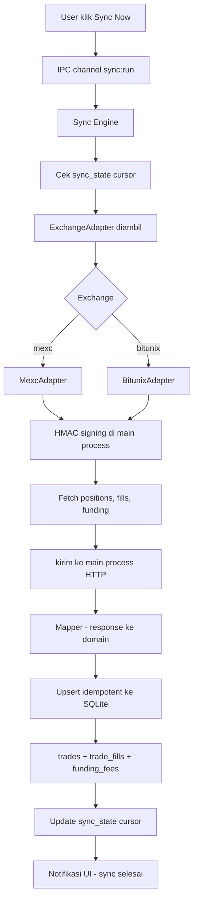

# Arsitektur — Aplikasi Trading Journal Otomatis (MEXC + Bitunix)

> Dokumen ini adalah turunan dari brief proyek. Brief = sumber kebenaran requirement.
> Dokumen ini menambah: keputusan teknis yang terkunci, struktur proyek, dan kontrak antar-layer.
> Ruang lingkup tetap **read-only** dan **single-user desktop**. Lihat §Out-of-scope di brief.

---

## 1. Keputusan Teknis Terkunci

Keputusan ini diambil sebelum Fase 1 karena mengunci skema DB dan konfigurasi build.

### D1 — `better-sqlite3` di-mark `external`; compile ulang TIDAK diperlukan

> **DIREVISI 2026-09-17 berdasarkan verifikasi empiris di Fase 0.** Asumsi awal di bawah
> ternyata keliru dan sudah dikoreksi. Lihat §Koreksi D1 untuk detailnya.

| Aspek | Ketetapan |
|---|---|
| Vite main-process | `better-sqlite3` ditandai `external` — **tidak boleh di-bundle** |
| `@electron/rebuild` | **TIDAK DIPAKAI** (lihat §Koreksi D1) |
| Mekanisme binary | Prebuilt **N-API** di dalam paket npm (`prebuilds/`), ABI-stabil |
| Verifikasi | `npm run smoke` — jalankan `scripts/smoke-test.cjs` di dalam Electron |

**Konsekuensi:** `external` tetap wajib. Native addon harus di-`require()` apa adanya saat
runtime; kalau di-bundle, binary `.node` di dalamnya rusak dan app crash.

#### Koreksi D1 (2026-09-17)

Asumsi awal: `better-sqlite3` memakai ABI Node, sehingga wajib di-rebuild ke ABI Electron
via MSVC + `@electron/rebuild`.

Hasil verifikasi Fase 0 membantahnya:

| Yang diasumsikan | Kenyataan |
|---|---|
| Perlu compile native via MSVC | **Tidak perlu.** `better-sqlite3@13.0.3` punya `"gypfile": false` dan mengirim `prebuilds/win32-x64.node` di dalam paket |
| Akan crash `NODE_MODULE_VERSION` mismatch | Berhasil dimuat di Electron 44.4.1 (ABI 149, NAPI 10) tanpa rebuild |
| Butuh Visual Studio C++ build tools | Tidak dibutuhkan. Terbukti `node-gyp rebuild` gagal karena MSVC tidak ada, namun app tetap berfungsi normal |

Binary prebuilt dinamai tanpa versi ABI (mis. `win32-x64.node`, bukan `node-v137`), yang
menandakan build N-API. N-API bersifat ABI-stabil lintas versi Node **dan** Electron.

Bukti: `npm run smoke` → 5/5 pemeriksaan lulus, termasuk `foreign_keys`, `ON DELETE CASCADE`,
partial unique index, dan WAL.

**Dampak:** satu prasyarat besar (install Visual Studio ~6 GB) hilang sepenuhnya dari
proyek ini. Yang **tetap** diperlukan hanyalah `external` di Vite.

### D2 — Kredensial via `safeStorage` bawaan Electron, `keytar` dibuang

| Aspek | Ketetapan |
|---|---|
| Mekanisme | [`safeStorage.encryptString()`](electron/credentials/keystore.ts:1) / `decryptString()` |
| Lokasi ciphertext | File terpisah di direktori `userData` Electron, **bukan** di SQLite dan **bukan** di repo |
| Keychain backend | DPAPI di Windows, Keychain di macOS, libsecret di Linux |
| `keytar` | **Ditolak** — sudah deprecated oleh maintainer, dan menambah native addon kedua yang memperbesar risiko build gagal |

**Konsekuensi:** jalur kredensial jadi: renderer → IPC → main process → `safeStorage` → exchange. Renderer **tidak pernah** menerima credential dalam bentuk plaintext kecuali saat user mengetiknya.

### D3 — `realized_pnl` dari exchange adalah source of truth

| Skenario | Metode |
|---|---|
| Sync dari MEXC / Bitunix (posisi tertutup tersedia) | Pakai `realized_pnl` yang dilaporkan exchange. Ditandai `pnl_source = 'exchange_reported'` |
| Manual entry | Dihitung user / input langsung. `pnl_source = 'manual'` |
| Posisi tertutup **tidak** tersedia dari API, hanya fills mentah | Hitung dengan **average-cost** dari fills. `pnl_source = 'computed_average_cost'` |
| FIFO | **Tidak dipakai** — perpetual futures punya satu entry price rata-rata per posisi, bukan antrian lot |

**Alasan:** menghitung ulang P&L dari fills ketika exchange sudah melaporkan angka final berisiko double-counting fee dan selisih presisi pembulatan. Field `pnl_source` disimpan eksplisit supaya keandalan tiap baris bisa diaudit — bukan diasumsikan seragam.

---

## 2. Struktur Proyek

```
/
├── package.json                    # deps + postinstall @electron/rebuild
├── electron-builder.yml            # konfigurasi installer
├── vite.config.ts                  # better-sqlite3 = external
├── tsconfig.json
├── .gitignore                      # data/, screenshots/, .env
├── .env.example                    # template committable
│
├── electron/                       # MAIN PROCESS — full Node access
│   ├── main.ts                     # entry, window, app lifecycle
│   ├── preload.ts                  # contextBridge — IPC surface sempit & bertipe
│   ├── credentials/
│   │   └── keystore.ts             # wrapper safeStorage            [D2]
│   ├── db/
│   │   ├── index.ts                # koneksi better-sqlite3 + PRAGMA
│   │   ├── migrations/
│   │   │   └── 001_init.sql
│   │   └── repositories/
│   │       ├── trades.ts
│   │       ├── journal.ts
│   │       ├── fills.ts
│   │       ├── funding.ts
│   │       ├── syncState.ts
│   │       └── settings.ts
│   ├── exchanges/                  # adapter per exchange
│   │   ├── types.ts                # kontrak ExchangeAdapter
│   │   ├── mexc/{client.ts,mapper.ts,index.ts}
│   │   └── bitunix/{client.ts,mapper.ts,index.ts}
│   ├── sync/
│   │   └── engine.ts               # incremental sync + upsert idempotent
│   └── ipc/
│       └── handlers.ts             # satu tempat registrasi channel IPC
│
├── src/                            # RENDERER — tanpa Node access
│   ├── main.tsx
│   ├── App.tsx
│   ├── routes/
│   │   ├── Dashboard.tsx
│   │   ├── TradeLog.tsx
│   │   ├── JournalEntry.tsx
│   │   ├── Analytics.tsx
│   │   └── Settings.tsx
│   ├── components/
│   ├── lib/
│   │   ├── analytics/              # perhitungan metric
│   │   └── formatting/
│   └── styles/
│
├── plans/                          # dokumen perencanaan ini
├── data/                           # GITIGNORED — file SQLite
├── screenshots/                    # GITIGNORED
└── tests/
```

**Batas yang tidak boleh dilanggar:** [`src/`](src/main.tsx:1) (renderer) tidak boleh meng-import apapun dari [`electron/db/`](electron/db/index.ts:1), [`electron/exchanges/`](electron/exchanges/types.ts:1), atau [`electron/credentials/`](electron/credentials/keystore.ts:1). Semua akses lewat IPC di [`preload.ts`](electron/preload.ts:1).

---

## 3. Alur Data



**Titik kritis:** HMAC signing hanya ada di main process. Renderer tidak pernah menyentuh secret, dan tidak pernah memanggil exchange langsung — ini yang menghilangkan masalah CORS dan menempatkan kredensial di proses paling terisolasi.

---

## 4. Kontrak Adapter Exchange

Kontrak ini yang memungkinkan Fase 2 (MEXC) dan Fase 3 (Bitunix) tidak mengubah sync engine sama sekali.

```ts
// electron/exchanges/types.ts

/** Satu posisi tertutup yang sudah dinormalisasi dari response exchange. */
export interface RawClosedPosition {
  externalId: string;        // id posisi/order dari exchange -> kunci dedup
  symbol: string;
  direction: 'long' | 'short';
  entryPrice: number;
  exitPrice: number;
  entryTime: number;         // epoch ms UTC
  exitTime: number;          // epoch ms UTC
  size: number;              // qty base
  leverage: number;
  marginMode: 'isolated' | 'cross';
  realizedPnl: number;
  feeOpen: number;
  feeClose: number;
  fundingFee: number;
}

export interface RawFill { /* ... */ }
export interface RawFundingFee { /* ... */ }

export interface SyncCursor {
  lastExitTime: number | null;   // batas incremental
  lastExternalId: string | null; // jaga-jaga jika timestamp sama
}

export interface ExchangeAdapter {
  readonly id: 'mexc' | 'bitunix';
  fetchClosedPositions(cursor: SyncCursor): Promise<RawClosedPosition[]>;
  fetchFills(cursor: SyncCursor): Promise<RawFill[]>;
  fetchFundingFees(cursor: SyncCursor): Promise<RawFundingFee[]>;
}
```

**Catatan penting:** enum `direction` dan `marginMode` di atas adalah **bentuk ternormalisasi internal kita**. Nama field asli dari MEXC/Bitunix bisa berbeda total — tugas [`mapper.ts`](electron/exchanges/mexc/mapper.ts:1) yang menerjemahkan. Jangan bocorkan bentuk response mentah exchange ke lapisan DB.

---

## 5. Konfigurasi Batas Sesi Trading

Brief §5.2 mewajibkan batas sesi didefinisikan eksplisit di config, bukan di-hardcode. Nilai awal (basis UTC), disimpan di tabel `settings` dan bisa diubah user:

| Sesi | Mulai UTC | Selesai UTC |
|---|---|---|
| Asia | 00:00 | 09:00 |
| London | 07:00 | 16:00 |
| New York | 12:00 | 21:00 |

**Keputusan penugasan (mengisi ambiguitas brief):** sesi ditentukan dari **`entry_time`**, bukan `exit_time`. Alasannya: setup dan kondisi pasar saat entry yang ingin dianalisis, bukan kondisi saat posisi ditutup. Trade yang melewati batas sesi tidak dipecah.

**Catatan:** London dan New York overlap pada 12:00–16:00 UTC. Trade di jam itu akan masuk ke dua bucket bila breakdown dihitung per sesi secara independen. Ini **disengaja** — tapi harus ditampilkan sebagai catatan di UI agar user tidak menjumlahkan persentase lintas sesi dan mengira totalnya 100%.

---

## 6. Strategi Sync

| Aspek | Ketetapan |
|---|---|
| Incremental | Simpan `lastExitTime` per exchange di `sync_state`. Fetch berikutnya hanya menarik data setelah cursor itu |
| Backfill awal | Sync pertama **tanpa filter tanggal** — wajib menangkap posisi yang dibuka manual di exchange sebelum app ini dipakai (brief §5.1) |
| Idempotensi | Unique key `(exchange, external_position_id)` di `trades`; `(exchange, external_fill_id)` di `trade_fills`; `(exchange, external_id)` di `funding_fees`. Upsert pakai `INSERT ... ON CONFLICT DO UPDATE` |
| Rate limit | Backoff eksponensial + retry. Angka rate limit **wajib diverifikasi** ke dokumentasi resmi tiap exchange saat Fase 2/3 — jangan pakai nilai dari memori |
| Auto-sync | **Default OFF**. User mengaktifkan sendiri via Settings (brief §4.3) |
| Proteksi jurnal | Sync hanya menulis ke `trades`, `trade_fills`, `funding_fees`. **Tidak pernah** menyentuh `trade_journal`. Lihat [`02-DATA-MODEL.md`](plans/02-DATA-MODEL.md:1) §3 |
