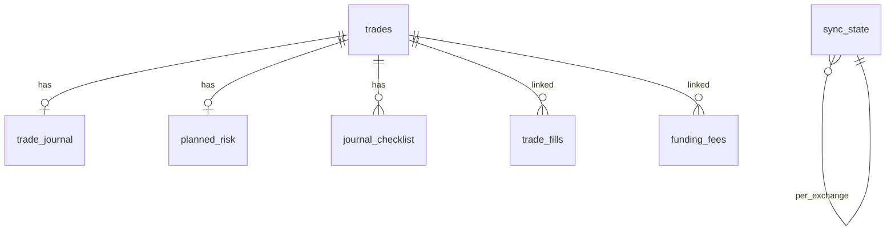

# Data Model — Aplikasi Trading Journal Otomatis

> SQLite lokal via `better-sqlite3`. Semua timestamp disimpan sebagai **epoch milliseconds UTC (INTEGER)**.
> Konversi ke timezone lokal **hanya** di layer presentasi (brief §5.1).

---

## 1. Prinsip

1. **Semua waktu UTC.** Tidak ada kolom waktu lokal di DB. Ini mencegah kelas bug DST dan pergeseran timezone.
2. **Domain terpisah dari bentuk exchange.** Bentuk response mentah MEXC/Bitunix diterjemahkan [`mapper.ts`](electron/exchanges/mexc/mapper.ts:1) sebelum masuk DB.
3. **Jurnal manual terisolasi dari sync.** Tabel `trade_journal` tidak pernah ditulis oleh sync engine. Ini melindungi pemikiran subjektif user dari tertimpa data exchange.
4. **Semua nilai uang INTEGER atau TEXT-stored-REAL?** → Lihat §2, ini keputusan eksplisit.

---

## 2. Keputusan Tipe Angka Keuangan

Ini keputusan yang tidak ada di brief dan berpotensi jadi sumber bug halus.

| Pendekatan | Keputusan | Alasan |
|---|---|---|
| Harga, qty, P&L, fee | **REAL** (float64) | Presisi float64 memadai untuk price/qty crypto. Menyimpan sebagai string desimal menambah kompleksitas parsing besar untuk keuntungan yang tidak berarti di aplikasi personal |
| Pembulatan tampilan | **Di layer presentasi saja** | DB menyimpan nilai apa adanya dari exchange. Pembulatan tampilan pakai formatter terpusat di [`src/lib/formatting/`](src/lib/formatting/index.ts:1) |
| Perbandingan | Dilarang `===` untuk float | Filter rentang pakai `>=` / `<=`, tidak pernah equality |

**Catatan:** exchange melaporkan P&L sebagai string desimal di JSON. Konversi ke number terjadi di mapper, satu kali, di satu tempat. Jangan menyebar `parseFloat` ke seluruh codebase.

---

## 3. Tabel `trades` — field otomatis dari exchange

```sql
CREATE TABLE trades (
  id              INTEGER PRIMARY KEY AUTOINCREMENT,
  exchange        TEXT    NOT NULL CHECK (exchange IN ('mexc','bitunix','manual')),
  external_id     TEXT,                    -- id posisi dari exchange; NULL untuk manual
  symbol          TEXT    NOT NULL,
  direction       TEXT    NOT NULL CHECK (direction IN ('long','short')),

  entry_price     REAL    NOT NULL,
  exit_price      REAL    NOT NULL,
  entry_time      INTEGER NOT NULL,        -- epoch ms UTC
  exit_time       INTEGER NOT NULL,        -- epoch ms UTC

  size            REAL    NOT NULL,
  leverage        REAL    NOT NULL,
  margin_mode     TEXT    CHECK (margin_mode IN ('isolated','cross')),

  realized_pnl    REAL    NOT NULL,
  pnl_source      TEXT    NOT NULL CHECK (pnl_source IN
                    ('exchange_reported','computed_average_cost','manual')),  -- [D3]

  fee_open        REAL    NOT NULL DEFAULT 0,
  fee_close       REAL    NOT NULL DEFAULT 0,
  fee_open_maker  REAL,                    -- NULL bila exchange tidak memecah maker/taker
  fee_close_maker REAL,
  funding_fee     REAL    NOT NULL DEFAULT 0,

  created_at      INTEGER NOT NULL,
  updated_at      INTEGER NOT NULL
);

-- Dedup idempotent (brief §4.3). Partial index: hanya baris dengan external_id.
CREATE UNIQUE INDEX idx_trades_dedup
  ON trades(exchange, external_id)
  WHERE external_id IS NOT NULL;

CREATE INDEX idx_trades_exit_time ON trades(exit_time);
CREATE INDEX idx_trades_symbol    ON trades(symbol);
```

**Keputusan penugasan:** `exchange` punya nilai ketiga `'manual'` yang tidak ada di brief §5.1 (yang hanya menyebut `mexc/bitunix`). Ini perlu supaya trade manual entry tidak dipaksa mengaku berasal dari exchange tertentu, sekaligus menjaga unique index dedup tetap bersih.

---

## 4. Tabel `trade_journal` — field manual (brief §5.3)

```sql
CREATE TABLE trade_journal (
  trade_id          INTEGER PRIMARY KEY REFERENCES trades(id) ON DELETE CASCADE,

  setup_tag         TEXT,                   -- user-defined, BUKAN enum tertutup
  pre_trade_thesis  TEXT,
  post_trade_review TEXT,
  emotion_tag       TEXT,
  execution_grade   TEXT CHECK (execution_grade IN ('A','B','C','D')),

  screenshot_path   TEXT,                   -- path lokal relatif ke screenshots/

  updated_at        INTEGER NOT NULL
);
```

**Aturan yang tidak boleh dilanggar (brief §5.3 dan §12):**

- `execution_grade` **TIDAK BOLEH** digabung dengan `realized_pnl` / win-loss dalam satu skor turunan manapun.
- Tabel ini **tidak pernah** ditulis oleh sync engine.
- `emotion_tag` disimpan sebagai TEXT bebas, bukan enum SQL — user boleh menambah tag sendiri. Validasi pilihan dilakukan di UI dengan daftar default: `calm / fomo / revenge / overconfident / anxious`.

---

## 5. Tabel `journal_checklist`

`rule_checklist` adalah daftar boolean custom. Karena jumlah item tidak tetap, ia tidak bisa jadi kolom di `trade_journal`.

```sql
CREATE TABLE journal_checklist (
  id        INTEGER PRIMARY KEY AUTOINCREMENT,
  trade_id  INTEGER NOT NULL REFERENCES trades(id) ON DELETE CASCADE,
  label     TEXT    NOT NULL,
  checked   INTEGER NOT NULL DEFAULT 0 CHECK (checked IN (0,1)),
  sort_order INTEGER NOT NULL DEFAULT 0
);

CREATE INDEX idx_checklist_trade ON journal_checklist(trade_id);
```

**Catatan:** template checklist default (mis. "sesuai rencana risk %") disimpan di `settings` sebagai template, lalu **di-copy** ke `journal_checklist` saat trade dibuat. Ini supaya mengubah template di masa depan tidak mengubah riwayat trade lama.

---

## 6. Tabel `planned_risk` — sumber `r_multiple`

`r_multiple` butuh stop-loss yang direncanakan. Brief §5.2 menegaskan: kalau user tidak input SL, field ini **null, jangan dipaksa dihitung**.

```sql
CREATE TABLE planned_risk (
  trade_id        INTEGER PRIMARY KEY REFERENCES trades(id) ON DELETE CASCADE,
  planned_stop    REAL,        -- harga SL yang direncanakan, NULL bila tidak diisi
  planned_target  REAL,
  risk_amount     REAL,        -- nominal risiko yang direncanakan
  planned_rr      REAL         -- risk:reward yang diniatkan
);
```

**Aturan `r_multiple`:**
- Jika `planned_stop` NULL → `r_multiple` **NULL**. Tidak dihitung, tidak diestimasi, tidak diisi 0.
- Jika ada → `r_multiple = realized_pnl / risk_amount`.
- Metric agregat yang bergantung pada R (mis. distribusi R-multiple) **wajib** melaporkan berapa trade yang punya R valid vs total. Histogram yang diam-diam hanya menggambar 30% data adalah bentuk kebohongan data.

---

## 7. Tabel pendukung

### `sync_state`
```sql
CREATE TABLE sync_state (
  exchange         TEXT PRIMARY KEY CHECK (exchange IN ('mexc','bitunix')),
  last_exit_time   INTEGER,      -- cursor incremental
  last_external_id TEXT,         -- tie-breaker bila timestamp identik
  last_sync_at     INTEGER,
  last_status      TEXT CHECK (last_status IN ('ok','partial','error')),
  last_error       TEXT
);
```

### `settings`
Penyimpanan key-value untuk konfigurasi non-kredensial.

```sql
CREATE TABLE settings (
  key   TEXT PRIMARY KEY,
  value TEXT NOT NULL        -- JSON-encoded
);
```

Key awal: `session_bounds` (definisi sesi dari [`01-ARCHITECTURE.md`](plans/01-ARCHITECTURE.md:1) §5), `colorblind_mode`, `auto_sync_enabled` (default `false`), `auto_sync_interval_min`, `checklist_template`, `theme`.

### `trade_fills` dan `funding_fees`
Detail granular dari exchange. Diperlukan untuk dua hal: audit saat ada selisih P&L, dan jalur fallback `computed_average_cost` (D3).

```sql
CREATE TABLE trade_fills (
  id           INTEGER PRIMARY KEY AUTOINCREMENT,
  trade_id     INTEGER REFERENCES trades(id) ON DELETE SET NULL,
  exchange     TEXT NOT NULL,
  external_id  TEXT NOT NULL,
  symbol       TEXT NOT NULL,
  side         TEXT NOT NULL CHECK (side IN ('buy','sell')),
  price        REAL NOT NULL,
  qty          REAL NOT NULL,
  fee          REAL NOT NULL DEFAULT 0,
  is_maker     INTEGER,
  filled_at    INTEGER NOT NULL
);

CREATE UNIQUE INDEX idx_fills_dedup ON trade_fills(exchange, external_id);

CREATE TABLE funding_fees (
  id          INTEGER PRIMARY KEY AUTOINCREMENT,
  exchange    TEXT NOT NULL,
  external_id TEXT NOT NULL,
  symbol      TEXT NOT NULL,
  amount      REAL NOT NULL,
  rate        REAL,
  charged_at  INTEGER NOT NULL
);

CREATE UNIQUE INDEX idx_funding_dedup ON funding_fees(exchange, external_id);
```

**Catatan:** `trade_id` di `trade_fills` boleh NULL (ON DELETE SET NULL) karena fill bisa ada sebelum berhasil dipasangkan ke posisi. Fill yatim ini tidak boleh hilang saat trade dihapus — ia adalah bukti audit.

---

## 8. PRAGMA Wajib saat Koneksi

Dijalankan di [`electron/db/index.ts`](electron/db/index.ts:1) setiap kali koneksi dibuka:

```sql
PRAGMA journal_mode = WAL;      -- baca saat tulis berjalan
PRAGMA foreign_keys = ON;       -- WAJIB, default SQLite adalah OFF
PRAGMA synchronous = NORMAL;    -- aman dengan WAL
```

**Gotcha:** `PRAGMA foreign_keys = ON` harus di-set **per koneksi**. Semua deklarasi `REFERENCES` di dokumen ini tidak akan ditegakkan tanpa ini.

---

## 9. Migrasi

- File bernomor berurutan di [`electron/db/migrations/`](electron/db/migrations/001_init.sql:1), mis. `001_init.sql`, `002_add_x.sql`.
- Tabel `schema_migrations(version INTEGER PRIMARY KEY, applied_at INTEGER)` mencatat versi yang sudah jalan.
- Migrasi dijalankan otomatis saat app start, di dalam transaksi.
- **Aturan keras:** migrasi yang sudah dirilis **tidak boleh di-edit**. Perubahan = migrasi baru. Alasannya: user yang sudah punya DB dengan migrasi lama akan mendapat skema berbeda dari user baru bila file lama diubah.

---

## 10. Skema Ringkas



> Relasi `trades` ke `funding_fees` bersifat longgar: funding diakumulasi per simbol dalam rentang waktu posisi terbuka, karena API tidak selalu memberi tautan funding ke posisi spesifik.
