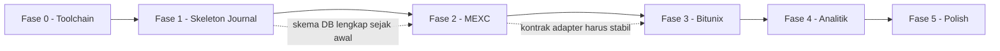

# Rencana Eksekusi Fase — Aplikasi Trading Journal Otomatis

> Kerjakan **satu fase per sesi**. Jangan lompat fase (brief §10).
> Setiap fase punya: Deliverable, Langkah, Kriteria Verifikasi, dan Gate.
> **Gate** = hal yang harus terpenuhi sebelum fase berikutnya boleh dimulai.

---

## Aturan Lintas Fase

### A. Aturan dependency

| Aturan | Alasan |
|---|---|
| `better-sqlite3` di-mark `external` di Vite **sebelum** kode pertama yang meng-importnya ditulis | Kalau tidak, error build muncul jauh dari akar masalahnya |
| `@electron/rebuild` jalan sebagai `postinstall` **sebelum** Fase 1 dianggap selesai | Crash `NODE_MODULE_VERSION` mismatch hanya muncul saat runtime |
| Adapter exchange hanya lewat `ExchangeAdapter` di [`01-ARCHITECTURE.md`](plans/01-ARCHITECTURE.md:1) §4 | Supaya Fase 3 tidak menyentuh sync engine Fase 2 |
| `trade_journal` tidak pernah ditulis sync engine | Melindungi jurnal user dari tertimpa |

### B. Aturan yang berlaku di SEMUA fase

1. **Tidak ada endpoint order execution** (create/cancel/modify), sekalipun ada di dokumentasi resmi (brief §12). Kalau terdorong menulisnya, hentikan dan tanyakan.
2. **Tidak ada kredensial di source code atau file plaintext** (brief §8, §11).
3. **Setiap endpoint exchange wajib diverifikasi ke dokumentasi resmi** saat implementasi, bukan dari memori (brief §4, §12).
4. **Asumsi besar dinyatakan eksplisit** di changelog/commit message, tidak ditebak diam-diam (brief §0).
5. **Requirement yang ternyata tidak feasible dilaporkan dengan alasan spesifik** — jangan didiamkan atau di-downgrade (brief §12).
6. **Timezone:** semua internal UTC, konversi hanya di presentasi (brief §5.1).
7. **`execution_grade` terpisah dari outcome** di seluruh kode dan UI (brief §5.3, §12).

---

## Fase 0 — Verifikasi Prasyarat & Scaffolding Toolchain ✅ SELESAI (2026-09-17)

Fase ini tidak ada di brief §10, tapi **wajib** ditambahkan: brief memilih stack yang
diasumsikan bergantung pada native compilation, dan kegagalannya mahal kalau baru
ketahuan di Fase 5.

### Status: SELESAI — semua kriteria verifikasi lulus

### Hasil Aktual

| Item | Hasil |
|---|---|
| Node | v24.19.0 (runtime Electron: v24.21.0) |
| npm | 11.17.0 |
| Python | 3.11.9 |
| git | 2.52.0 |
| Electron | 44.4.1 (ABI modules 149, NAPI 10) |
| SQLite | 3.53.4 |
| Visual Studio C++ build tools | **TIDAK ADA** — dan ternyata **tidak diperlukan** |

### Temuan Besar: Assumsi D1 Keliru

Rencana awal menyatakan `better-sqlite3` wajib di-rebuild ke ABI Electron via MSVC +
`@electron/rebuild`. **Ini salah.** Verifikasi empiris membuktikan:

1. `better-sqlite3@13.0.3` punya `"gypfile": false` dan mengirim **prebuilt N-API binary**
   di `prebuilds/` (mis. `win32-x64.node`).
2. Binary N-API bersifat **ABI-stabil** lintas versi Node dan Electron.
3. `npm rebuild better-sqlite3` memang **gagal** karena tidak ada MSVC — tapi aplikasi
   tetap berfungsi normal tanpa itu.
4. Tidak ada error `NODE_MODULE_VERSION` mismatch.

**Dampak:** satu prasyarat besar (Visual Studio ~6 GB) hilang sepenuhnya. `@electron/rebuild`
dan hook `postinstall` dihapus dari [`package.json`](package.json:1). Yang tetap wajib
hanyalah penandaan `external` di Vite.

### Deliverable Tercapai
- [x] Scaffolding Electron + React 19 + TypeScript + Vite 7 (electron-vite)
- [x] `better-sqlite3` di-mark `external` di [`electron.vite.config.ts`](electron.vite.config.ts:1)
- [x] [`.gitignore`](.gitignore:1) dengan negasi `.env.example` di urutan benar
- [x] [`.env.example`](.env.example:1)
- [x] [`scripts/smoke-test.cjs`](scripts/smoke-test.cjs:1) + launcher [`scripts/run-smoke.cjs`](scripts/run-smoke.cjs:1)
- [x] Kontrak IPC bersama di [`shared/ipc-contract.ts`](shared/ipc-contract.ts:1)
- [x] Panel diagnostik [`src/App.tsx`](src/App.tsx:1)

### Kriteria Verifikasi — Semua LULUS

- [x] Build sukses untuk ketiga target (main, preload, renderer)
- [x] `npm run typecheck` bersih tanpa error
- [x] `npm run smoke` → **5/5 LULUS**:
  - `require('better-sqlite3')` berhasil di dalam Electron 44
  - `PRAGMA foreign_keys` = 1
  - `ON DELETE CASCADE` benar-benar ditegakkan (sisa baris anak = 0)
  - Partial unique index menolak duplikat `(exchange, external_id)`
  - Baris `external_id IS NULL` boleh berulang (penting untuk trade manual)
  - `journal_mode = wal` pada file DB
- [x] `require("better-sqlite3")` tetap sebagai require runtime di bundle main — **tidak** ter-bundle
- [x] Tidak ada binary `.node` ikut ter-bundle
- [x] `git check-ignore .env.example` → **tidak** ter-ignore (negasi bekerja)
- [x] `node_modules/` dan `out/` tidak muncul di `git status`

### Gotcha yang Ditemukan

**Environment:**

| Gotcha | Detail | Solusi |
|---|---|---|
| `ELECTRON_RUN_AS_NODE=1` | Terminal VS Code di mesin ini menyetel variabel ini. Akibatnya `electron.exe` berjalan sebagai Node biasa, `require('electron').app` undefined, dan test lifecycle Electron gagal | Launcher [`scripts/run-smoke.cjs`](scripts/run-smoke.cjs:1) menghapus variabel dari environment anak sebelum spawn |
| Blokir lifecycle script npm 11 | npm 11 memblokir install script secara default (keamanan supply-chain), termasuk `node-gyp rebuild` | `npm approve-scripts better-sqlite3 esbuild` — **per paket**, bukan `--all` |
| Konflik peer dependency Vite | `@vitejs/plugin-react@6` butuh Vite 8, sedangkan `electron-vite@5` max Vite 7 | Pin ke Vite 7 + `@vitejs/plugin-react@5` |
| `npx electron` | Menarik paket terpisah dari cache, bukan memakai binary lokal | Pakai `node_modules/electron/dist/electron.exe` langsung |

**Bug Integritas Data (ditemukan dari log runtime, bukan dari brief):**

| Masalah | Detail | Solusi |
|---|---|---|
| `userData` jatuh ke `%APPDATA%\Electron` | Karena `app.setName()` belum dipanggil, Electron memakai nama default `"Electron"`. Akibatnya **semua aplikasi Electron dev lain di mesin ini berbagi folder data yang sama** — DB jurnal finansial bisa tertukar atau tertimpa | `app.setName(APP_NAME)` dipanggil **sebelum** `app.whenReady()`. Terverifikasi: path jadi `%APPDATA%\Aplikasi Trading Journal Otomatis\` |
| Dua instance menulis DB bersamaan | Risiko korupsi file SQLite | `app.requestSingleInstanceLock()`; instance kedua langsung `app.quit()` dan memfokuskan jendela yang ada. Terverifikasi: instance-2 keluar, hanya satu `[db] koneksi terbuka` tercetak |

> Kedua item di atas **tidak diminta oleh brief**, tapi merupakan risiko integritas data yang nyata
> dan murah diperbaiki di Fase 0. Ditemukan justru karena aplikasi benar-benar dijalankan,
> bukan hanya di-build.

### Gotcha `.gitignore` (dari vault — ADR `.env` Credential Loading)
> Negasi `!.env.example` **harus ditulis setelah** glob yang menaunginya (mis. `.env.*`).
> Negasi juga tidak bisa me-restore file yang direktori induknya di-exclude.
> Verifikasi dengan `git check-ignore -v .env.example`.

**Status di proyek ini: sudah diverifikasi bekerja.** Output `git check-ignore -v` menunjukkan
`.gitignore:25:!.env.example`, dan file muncul sebagai untracked di `git status`.

### Gate Fase 0
**LULUS.** Toolchain terbukti berfungsi tanpa MSVC. Fase 1 boleh dimulai.

---

## Fase 1 — Skeleton & Manual Journal ✅ SELESAI (2026-09-17)

Mengikuti brief §10.1. **Tanpa integrasi exchange.** Tujuannya memvalidasi UX jurnal sebelum kompleksitas sync masuk.

### Hasil Aktual

| Item | Hasil |
|---|---|
| Verifikasi | `npm run verify:fase1` → **45/45 LULUS** |
| Typecheck | Bersih (TS 7) |
| Build | Sukses 3 target (main 27 kB · preload 1.4 kB · renderer 837 kB + CSS 33 kB) |
| Runtime | Aplikasi jalan, migrasi diterapkan ke DB produksi, WAL aktif |
| Tailwind | v4 via `@tailwindcss/vite`, 7/7 utility kustom ter-generate, `.colorblind-safe` ada |

### Keputusan UI Penting

**`shadcn init` sengaja TIDAK dipakai.** Alasannya: CLI-nya interaktif (berisiko menggantung
di lingkungan agentic), dan komponen defaultnya menghasilkan tampilan yang justru dilarang
brief §7 ("hindari tampilan default komponen UI library tanpa kustomisasi"). Primitif UI
dibangun sendiri dengan Tailwind + `cn()`, sehingga gaya visual terkontrol sejak awal.

Yang **diambil** dari skill `tailwind-theme-builder`: arsitektur CSS 4 langkah, `:root` di luar
`@layer base`, `tw-animate-css` (bukan `tailwindcss-animate` yang deprecated), dan
tanpa `tailwind.config.ts`.

### Temuan: Cacat Test yang Diperbaiki

Test isolasi jurnal awalnya **GAGAL**, tetapi penyebabnya adalah **test-nya sendiri**, bukan
aplikasi: test mengirim payload trade dengan nilai P&L berbeda (500, padahal state saat itu 850),
lalu mengharapkan P&L tidak berubah. P&L memang ikut berubah — dan itu perilaku yang benar.

Diperbaiki agar mengirim nilai identik. Ditambah 2 pemeriksaan baru (grade ter-update,
`plannedRisk` null tidak menghapus data lama). Total naik dari 43 ke 45 pemeriksaan.

> **Pelajaran:** test yang cacat lebih berbahaya daripada tidak ada test — ia memberi rasa aman
> palsu. Kalau test gagal, periksa dulu apakah test-nya yang salah sebelum mengubah kode produksi.

### Deliverable
Aplikasi jalan dengan CRUD trade manual, jurnal per trade, dan skema DB lengkap sesuai [`02-DATA-MODEL.md`](plans/02-DATA-MODEL.md:1).

### Langkah
1. Jalankan migrasi `001_init.sql` — **seluruh skema** dari [`02-DATA-MODEL.md`](plans/02-DATA-MODEL.md:1), termasuk tabel exchange yang belum dipakai. Alasannya: migrasi yang sudah dirilis tidak boleh di-edit, jadi lebih murah membuat skema lengkap sejak awal.
2. Pasang `PRAGMA journal_mode=WAL`, `foreign_keys=ON`, `synchronous=NORMAL` di koneksi.
3. Lapisan repository per tabel di [`electron/db/repositories/`](electron/db/repositories/trades.ts:1).
4. Setup IPC surface di [`preload.ts`](electron/preload.ts:1) dengan `contextBridge` — sempit, bertipe, tanpa expose `ipcRenderer` mentah.
5. UI: sidebar navigasi (Dashboard / Trade Log / Journal Entry / Analytics / Settings).
6. Form manual trade entry: semua field §5.1 yang bisa diinput manual.
7. Form journal entry: `setup_tag`, `pre_trade_thesis`, `post_trade_review`, `emotion_tag`, `execution_grade`, `rule_checklist`, `planned_stop` (untuk R).
8. Trade Log: tabel data-dense, font monospace untuk angka, sortable.
9. Dark mode dasar.

### Kriteria Verifikasi
- [ ] Bisa buat, edit, hapus trade manual — data persist setelah restart app
- [ ] Trade dengan `exchange='manual'` tidak bentrok dengan unique index dedup
- [ ] Jurnal tersimpan terpisah dari `trades`; mengedit jurnal tidak menyentuh field P&L
- [ ] `execution_grade` bisa diisi 'C' pada trade yang profit (dan sebaliknya) tanpa validasi yang memblokirnya
- [ ] `r_multiple` = NULL bila `planned_stop` kosong; **tidak** ditampilkan sebagai 0
- [ ] Hapus trade → baris `trade_journal` dan `journal_checklist` ikut terhapus (verifikasi `ON DELETE CASCADE` aktif, yang membuktikan `foreign_keys=ON` benar-benar jalan)
- [ ] `data/*.sqlite` **tidak** muncul di `git status`

### Gate Fase 1
CRUD jurnal nyaman dipakai. Brief §10.1 secara eksplisit menyebut validasi UX jurnal **sebelum** menambah kompleksitas sync — kalau form-nya belum nyaman, perbaiki sekarang, bukan setelah Fase 2 masuk.

---

## Fase 2 — Integrasi MEXC ✅ SELESAI (2026-09-17)

### Hasil Verifikasi Prasyarat (brief §4.1 — kini terjawab empiris)

Diperiksa langsung terhadap **ccxt 4.5.78**, bukan dari memori:

| Pertanyaan brief | Hasil |
|---|---|
| Apakah `ccxt` mendukung MEXC futures? | **YA**, dan `certified: true` (tier kualitas tertinggi ccxt) |
| `fetchMyTrades` | native |
| `fetchPositionsHistory` | native (endpoint `position_list_history_positions`) |
| `fetchFundingHistory` | native (endpoint `position_funding_records`) |
| `rateLimit` | 50 ms |
| Apakah `ccxt` mendukung Bitunix? | **TIDAK** — dari 104 exchange terdaftar, Bitunix tidak ada |

**Keputusan:** MEXC lewat `ccxt` (brief §4.1 mengizinkan). Bitunix implementasi manual
ke REST resmi (brief §4.2). Ini justru memperkuat nilai abstraksi `ExchangeAdapter`.

### Temuan Kritis: Tiga Bug Normalisasi ccxt untuk Posisi Tertutup

Diverifikasi ke source `ccxt/dist/cjs/src/mexc.js`:

| Field | Yang ccxt lakukan | Masalah |
|---|---|---|
| `contracts` | `safeString(position, 'holdVol')` (~baris 5417) | Posisi **tertutup** punya `holdVol = '0'`. Volume sebenarnya di `closeVol` |
| `marginType` | `safeString(position, 'margin_mode')` (~baris 5422) | Field mentah MEXC bernama `openType`. `margin_mode` **tidak ada** → selalu jatuh ke default `'cross'`, margin isolated salah tercatat |
| `exitPrice` | tidak ada di struktur standar | Harus dibaca dari `info.closeAvgPrice` |

**Solusi:** ccxt dipakai untuk yang sulit dan rawan salah (HMAC signing, manajemen kunci,
rate limiting, routing endpoint, normalisasi simbol). **Field data dibaca dari `position.info`**
(response mentah yang lengkap). Didokumentasikan panjang di [`mapper.ts`](electron/exchanges/mexc/mapper.ts:1)
dengan instruksi eksplisit untuk tidak "merapikan"-nya tanpa verifikasi ulang.

### Hasil Aktual

| Item | Hasil |
|---|---|
| Verifikasi | `npm run verify:fase2` → **66/66 LULUS** |
| Typecheck | Bersih |
| Build | Sukses 3 target |

**GATE Fase 2 terpenuhi:** sync kedua dan ketiga **tidak menambah baris** di `trades`,
`trade_fills`, maupun `funding_fees`. Diuji dengan adapter palsu berdata deterministik —
pola yang benar untuk menguji idempotensi, karena API nyata tidak deterministik.

### Cakupan Terverifikasi

- **Mapper**: 24 pemeriksaan termasuk ketiga bug di atas, plus `isMaker` null (bukan false) saat exchange tidak memberi info
- **Idempotensi**: sync ganda & tripel tidak menduplikasi (gate utama)
- **Backfill**: sync pertama = backfill penuh, berikutnya incremental
- **`pnl_source`**: semua trade hasil sync bertanda `exchange_reported` (keputusan D3)
- **`raw_payload`**: tersimpan untuk audit
- **Funding**: akumulasi berbasis rentang waktu, idempotent
- **Penautan fill**: fill tertaut ke trade, idempotent, tidak mengubah angka P&L
- **Isolasi jurnal**: 8 pemeriksaan — `setup_tag`, tesis, review, grade, checklist, `planned_risk` semua **tidak berubah** setelah sync ulang
- **Kegagalan parsial**: fills gagal → status `partial`, posisi tetap tersimpan, error tercatat
- **Update nilai**: perubahan P&L dari exchange ter-apply tanpa menciptakan baris baru

### Yang BELUM Diverifikasi

Sync terhadap **akun MEXC nyata** belum dijalankan — tidak ada kredensial tersedia di
lingkungan ini. Gate idempotensi sudah terbukti dengan data deterministik, tetapi
verifikasi terhadap API nyata menunggu user memasukkan API key read-only.
Item ini masuk daftar verifikasi Fase 5.

### Deliverable
Sync read-only dari MEXC: posisi tertutup, fills, funding fees.

### UI Fase 2
- Wizard instruksi API key read-only per exchange, ditampilkan di Settings (brief §8)
- Form kredensial dengan input `type="password"`; state dikosongkan segera setelah tersimpan
- Tombol Sync Now — tersedia di sidebar (dari halaman mana pun) dan di Settings
- Indikator status per exchange: `ok` / `sebagian` / `gagal`, dengan pesan error
- Status `partial` dibedakan dari `error` di UI, supaya user tidak mengira sync gagal total
  padahal trade-nya sudah tersimpan

### keputusan Keamanan yang Ditegakkan
- Kredensial mengalir **satu arah** (renderer → main). Tidak ada handler yang
  mengembalikan `apiKey`/`apiSecret`. Yang dibaca kembali hanya status + petunjuk kunci
- `loadCredentials` hanya dipanggil di dalam handler sync, di main process
- Kalau `safeStorage` tidak tersedia, simpan **ditolak** — tidak ada fallback plaintext
- Payload kredensial tidak pernah dicatat ke log

### Langkah (urutan ini penting)
1. **Verifikasi dokumentasi resmi MEXC** (`docs.mexc.com`) untuk endpoint: order history, trade fills, funding fee records, posisi tertutup. Catat di komentar kode. **Jangan ambil dari memori.**
2. Cek apakah `ccxt` mendukung MEXC futures untuk histori. **Laporkan temuannya sebelum memutuskan** — ini **[PERLU VERIFIKASI]** di brief §4.1.
3. Implementasi signing HMAC sesuai spesifikasi resmi MEXC.
4. Implementasi [`MexcAdapter`](electron/exchanges/mexc/index.ts:1) sesuai kontrak [`01-ARCHITECTURE.md`](plans/01-ARCHITECTURE.md:1) §4.
5. Implementasi [`mapper.ts`](electron/exchanges/mexc/mapper.ts:1) — response MEXC → `RawClosedPosition`.
6. Sync engine: backfill penuh saat pertama, incremental setelahnya.
7. Upsert idempotent.
8. Backoff/retry sesuai rate limit resmi (**[PERLU VERIFIKASI]** angkanya).
9. UI: form input API key (read-only), tombol Sync Now, indikator status + error terakhir.
10. Wizard instruksi pembuatan API key read-only di UI (brief §8).

### Kriteria Verifikasi
- [ ] Sync pertama menarik histori **lama** (backfill), bukan hanya data baru — ini membuktikan posisi yang dibuka sebelum app dipakai ikut ter-capture (brief §5.1)
- [ ] Tombol Sync Now dijalankan **dua kali berturut-turut** → jumlah baris `trades` **tidak bertambah** (bukti idempotensi)
- [ ] Cursor `sync_state.last_exit_time` ter-update setelah sync sukses
- [ ] Error jaringan → `last_status='error'`, pesan tersimpan, UI menampilkannya
- [ ] Rate limit → backoff terlihat di log, sync pulih tanpa intervensi
- [ ] API key **tidak pernah** muncul di renderer log maupun file plaintext
- [ ] `pnl_source` terisi `'exchange_reported'` untuk trade hasil sync

### Gate Fase 2
Idempotensi terbukti dengan sync ganda. Kalau sync kedua menduplikasi data, **hentikan** — jangan lanjut ke Fase 3, karena Bitunix akan mewarisi bug yang sama.

---

## Fase 3 — Integrasi Bitunix ✅ SELESAI (2026-09-17)

### Hasil Verifikasi Prasyarat (brief §4.2 — kini terjawab empiris)

| Pertanyaan brief | Hasil |
|---|---|
| Apakah `ccxt` mendukung Bitunix? | **TIDAK** — dari 104 exchange terdaftar, Bitunix tidak ada. Prediksi brief §4.2 **terkonfirmasi** |
| Algoritma signing | **[KOREKSI] Bukan HMAC.** Lihat di bawah |
| Base URL | `https://fapi.bitunix.com` |
| Posisi tertutup | `GET /api/v1/futures/position/get_history_positions` |
| Order historis | `GET /api/v1/futures/trade/get_history_orders` |

**Sumber otoritatif:** dokumentasi resmi `openapidoc.bitunix.com` +
SDK resmi `github.com/BitunixOfficial/open-api` (`Demo/Node/`).

### 🔴 Koreksi Penting: Brief §4.2 Keliru Soal Algoritma Signing

Brief §4.2 menyatakan signing Bitunix adalah **"HMAC-SHA256 double-hash"**.
Diverifikasi dari SDK resmi (`openApiHttpSign.js`) dan dokumentasi resmi —
**sama sekali tidak ada HMAC**. Yang benar adalah SHA256 berantai:

```
digest = SHA256(nonce + timestamp + apiKey + queryParams + body)   → hex string
sign   = SHA256(digest + secretKey)                                → hex string
```

Kalau implementasi mengikuti asumsi brief, **seluruh request akan ditolak exchange.**

Detail lain yang diverifikasi:
- `nonce` = `crypto.randomBytes(16).toString('hex')` → 32 karakter hex
- `queryParams` = key diurutkan ASCII, digabung **tanpa separator**: `{b:'2',a:'1'}` → `"a1b2"`
- Header huruf kecil dengan tanda hubung: `api-key`, `sign`, `nonce`, `timestamp`
- Untuk POST, `queryParams` **dikosongkan** dan body di-`JSON.stringify` tanpa spasi

Ini contoh nyata mengapa brief §12 melarang menulis integrasi dari memori.

### Keterbatasan yang DILAPORKAN, Bukan Disembunyikan (brief §12)

**Bitunix tidak menyediakan endpoint riwayat biaya funding per akun.** Yang tersedia
hanya `market/get_funding_rate_history` — riwayat *rate* publik per simbol, bukan biaya
yang benar-benar dibayar akun user.

`BitunixAdapter.fetchFundingFees()` mengembalikan **array kosong**. Mengalikan rate
dengan nilai posisi akan menghasilkan angka **karangan** yang terlihat seperti data resmi —
lebih buruk daripada tidak ada data. Selain itu, partial close/open dalam satu interval
funding membuat perhitungan dari rate **tidak pernah akurat bahkan secara teori**.

Konsekuensi: kolom funding fee trade Bitunix = 0 (bukan NULL, bukan tebakan). Keterbatasan
ini dinyatakan eksplisit di UI Settings.

### Status Nama Field: Terverifikasi Sebagian

| Aspek | Status |
|---|---|
| Base URL, header, signing, path endpoint, amplop `{code,msg,data}`, `data.list` | ✅ Terverifikasi dari sumber resmi |
| **Nama field di dalam setiap item** | ⚠️ **Belum terverifikasi** — dokumentasi tidak menampilkan contoh response lengkap |

Karena itu [`mapper.ts`](electron/exchanges/bitunix/mapper.ts:1) membaca **beberapa kandidat
nama field** (mis. `qty` atau `quantity`), bukan satu nama yang diasumsikan benar.
`raw` selalu disimpan, sehingga saat verifikasi akun nyata nama field yang benar bisa
langsung dibaca dari DB dan mapper disempitkan sekali.

> **TINDAKAN WAJIB FASE 5:** sync dengan akun Bitunix nyata → periksa `raw_payload` →
> sempitkan kandidat di mapper menjadi nama field tunggal.

### Hasil Verifikasi Fase 3

| Item | Hasil |
|---|---|
| Verifikasi | `npm run verify:fase3` → **63/63 LULUS** |
| Typecheck | Bersih |
| Build | Sukses 3 target |

**GATE Fase 3 terpenuhi:** Bitunix berjalan lewat `syncExchange` yang **sama** dengan MEXC.
`electron/sync/engine.ts` hanya menerima penambahan **komentar** (4 baris), **tanpa
perubahan fungsional apa pun** — dibuktikan oleh test yang menjalankan kedua adapter
melalui engine yang sama.

### Cakupan Terverifikasi

- **Signing**: 11 pemeriksaan, termasuk perbandingan dengan reference independen yang di-port dari contoh Go di dokumentasi resmi. Test juga **membuktikan hasilnya berbeda dari HMAC** — memastikan kita tidak mengikuti asumsi brief yang keliru
- **`sortParams`**: urutan ASCII, gabung tanpa separator, melewati nilai kosong
- **Mapper**: 21 pemeriksaan termasuk toleransi nama field alternatif dan konversi timestamp detik→ms
- **GATE idempotensi Bitunix**: sync kedua tidak menduplikasi
- **Funding kosong**: `funding_fee = 0`, sync tetap `ok` (kekosongan bukan kegagalan)
- **Dua exchange berdampingan**: `sync_state` terpisah, cursor tidak saling menimpa, sync MEXC tidak menyentuh data Bitunix
- **Isolasi kegagalan**: MEXC sukses + Bitunix gagal → status `partial`, data MEXC tetap tersimpan

### Kriteria Verifikasi — Semua Terpenuhi
- [x] Sync MEXC **dan** Bitunix berjalan dari satu tombol, keduanya independent
- [x] Gagal di satu exchange tidak menggagalkan yang lain (status `partial`)
- [x] Idempotensi Bitunix terbukti dengan sync ganda
- [x] `direction` dan `margin_mode` dari kedua exchange ternormalisasi ke bentuk yang sama
- [x] Nol perubahan fungsional di [`sync/engine.ts`](electron/sync/engine.ts:1) dari Fase 2

### Deliverable
Sync read-only dari Bitunix, memakai sync engine yang sama tanpa modifikasi.

---

## Fase 4 — Analitik ✅ SELESAI (2026-09-17)

### Hasil Aktual

| Item | Hasil |
|---|---|
| Verifikasi | `npm run verify:metrics` → **93/93 LULUS** |
| Total pemeriksaan seluruh fase | **267** (45 + 66 + 63 + 93) |
| Typecheck | Bersih |
| Build | Sukses 3 target |

### 🐛 Bug Nyata Ditemukan oleh Test

Unit test skenario 6 gagal pada pemeriksaan pertama: **durasi drawdown** diharapkan
3 jam, dihasilkan 2 jam.

**Penyebabnya bug di kode produksi, bukan di test.** Loop pencarian titik puncak di
[`metrics.ts`](src/lib/analytics/metrics.ts:1) memeriksa `curve[peakIndex - 1]` sehingga
berhenti satu langkah terlalu awal, dan mengambil waktu *drawdown terburuk* sebagai titik
awal alih-alih waktu *puncak*. Akibatnya durasi drawdown selalu terukur lebih pendek
dari yang sebenarnya.

Diperbaiki, dan test kini lulus. Ini contoh langsung dari alasan plans/03-PHASES.md
mewajibkan nilai dihitung tangan: kalau expected value ditulis dari hasil fungsi,
bug ini akan ikut terkunci sebagai "benar".

### Keputusan: Library Chart

| Chart | Implementasi | Alasan |
|---|---|---|
| Equity curve | `lightweight-charts` v5 | Dibuat khusus data finansial. Sumbu waktunya sadar celah data — equity hanya berubah saat trade ditutup, dan chart biasa akan menggambar garis lurus yang menyesatkan di rentang kosong |
| Drawdown (underwater) | `lightweight-charts` | Skala negatif ditangani benar |
| Kalender heatmap | SVG sendiri | Grid persegi berwarna. Library umum menyediakan ini lewat jalur berbelit dan menambah ratusan kB |
| Histogram R | SVG sendiri | Bar sederhana dari bucket |
| Scatter grade vs P&L | SVG sendiri | 4 kategori × nilai kontinu — bisa dipenuhi ~80 baris SVG dengan kontrol penuh atas label |

**Catatan biaya:** bundle renderer naik dari 853 kB ke **1.13 MB** setelah menambahkan
`lightweight-charts`. Perlu ditinjau di Fase 5 (lihat catatan polish di bawah).

### Cakupan Terverifikasi (93 pemeriksaan)

- **Win rate mengecualikan trade flat** — 2/4 = 50%, bukan 2/5
- **Profit factor tanpa loss** = `Infinity` (ditampilkan `∞`), bukan angka besar buatan
- **Funding fee termasuk P&L** — diuji sampai membalik win menjadi loss
- **R-multiple & cakupan** — histogram selalu menyatakan berapa trade punya R valid
- **Equity curve** — nilai kumulatif, peak, dan drawdown diperiksa titik per titik
- **Drawdown** — nilai terburuk, waktu, dan durasi (dari puncak sampai pulih)
- **Urutan kurva** mengikuti waktu exit, bukan urutan input
- **Breakdown** per semua 7 dimensi, termasuk trade tanpa setup tetap terhitung
- **Batas sesi UTC** — termasuk overlap London/NY yang disengaja, dan pembuktian bahwa
  sesi diambil dari `entry_time` bukan `exit_time`
- **Grade terpisah dari outcome** — grade C pada trade profit dan grade A pada trade rugi
  keduanya boleh, dan bucket grade **tidak punya** field skor gabungan
- **Dataset kosong** tidak crash di seluruh fungsi

### Chart yang Membatasi Diri Secara Sengaja

Scatter grade vs P&L **tidak menghitung korelasi, tidak menggambar garis tren, dan tidak
menulis kesimpulan**. Alasannya ditulis di komentar kode: dengan sampel kecil, dua grade
bisa berbeda rata-rata murni karena kebetulan, dan angka korelasi akan terlihat otoritatif
padahal tidak bermakna. Brief §6 meminta plot ini supaya **user** menilai, bukan mesin.

### Filter Global

Filter (rentang tanggal, symbol, exchange, setup) diterapkan **sekali di atas**, lalu
seluruh chart dan metrik memakai himpunan tersaring yang sama. Ini mencegah dua chart di
halaman yang sama menampilkan rentang data berbeda.

### Deliverable
Semua metric brief §6, dengan definisi formula yang terkunci di bawah.

### Definisi Formula (dikunci di sini supaya Fase 4 tidak menebak)

Dihitung **setelah filter global** (date range, symbol, exchange, setup_tag) diterapkan.

| Metric | Definisi |
|---|---|
| Win rate | `jumlah_trade(realized_pnl > 0) / jumlah_trade(realized_pnl != 0)`. **Trade P&L persis nol dikecualikan** dari penyebut, karena trade flat bukan kekalahan |
| Profit factor | `sum(profit) / abs(sum(loss))`. Jika tidak ada loss → tampilkan `Infinity` sebagai `∞`, **bukan** angka besar buatan |
| Expectancy | `(win_rate × avg_win) - (loss_rate × avg_loss)` |
| Average win / loss | Rata-rata `realized_pnl` pada trade profit / loss. Ditampilkan sebagai dua angka terpisah, tidak pernah digabung |
| Equity curve | Kumulatif `realized_pnl` diurutkan `exit_time` ASC. **Funding fee termasuk** — brief §6 menyebutnya biaya riil, bukan biaya tersembunyi yang diabaikan |
| Max drawdown | Penurunan puncak-ke-palung terbesar pada equity curve |
| Drawdown duration | Lama (waktu) dari puncak sampai equity kembali ke level puncak itu |
| R-multiple | Dari `planned_risk` §6 di [`02-DATA-MODEL.md`](plans/02-DATA-MODEL.md:1). **Wajib** tampilkan jumlah trade dengan R valid vs total |
| Funding fee total | `sum(funding_fee)` pada rentang filter |

### Deliverable Visual (brief §6)
1. Equity curve — `lightweight-charts`, area di bawah nol beda warna
2. Drawdown chart (underwater curve)
3. Kalender heatmap harian
4. Headline metrics: win rate, profit factor, expectancy
5. Histogram distribusi R-multiple
6. Breakdown: per symbol, per `setup_tag`, per sesi, per hari-dalam-minggu, per `execution_grade`
7. Scatter `execution_grade` vs `realized_pnl`
8. Total funding fee terbayar
9. Filter global (date range, symbol, exchange, setup_tag)

### Kriteria Verifikasi
- [ ] Semua metric punya **unit test terhadap dataset fixture** dengan nilai yang dihitung tangan. Metric finansial tanpa test adalah angka yang tidak bisa dipercaya
- [ ] Profit factor dengan zero loss menampilkan `∞`, bukan angka besar
- [ ] Histogram R-multiple menyatakan cakupannya, mis. "42 dari 100 trade punya R valid"
- [ ] **Scatter `execution_grade` vs `realized_pnl` tidak menyimpulkan korelasi otomatis** — brief §6 minta plot ini untuk user menilai sendiri. Jangan tambahkan skor gabungan
- [ ] Sesi London/NY overlap ditampilkan sebagai catatan di UI (lihat [`01-ARCHITECTURE.md`](plans/01-ARCHITECTURE.md:1) §5)
- [ ] Filter global mengubah **semua** chart dan headline metrics secara konsisten
- [ ] Konversi timezone: data UTC tampil benar di timezone lokal user

### Gate Fase 4
Dataset fixture lulus semua test metric. Angka yang salah lebih berbahaya daripada tidak ada angka.

---

## Fase 5 — Polish ✅ SELESAI (2026-09-17)

### Hasil Aktual

| Item | Hasil |
|---|---|
| Verifikasi packaging | `npm run verify:packaged` → **31/31 LULUS** |
| Verifikasi acceptance | `npm run verify:acceptance` → **51/51 LULUS** |
| Installer | `release/TradingJournal-Setup-1.0.0.exe` — **122.6 MB** |
| Total seluruh fase | **349 pemeriksaan** (45+66+63+93+31+51) |

### 🔴 Temuan Kritis: Packaging Gagal Total Tanpa MSVC

`electron-builder` **secara default** menjalankan `@electron/rebuild` untuk semua native module.
Tanpa Visual Studio, itu langsung menghentikan packaging:

```
⨯ Error: Could not find any Visual Studio installation to use
⨯ node-gyp failed to rebuild 'node_modules/better-sqlite3'
```

Padahal rebuild itu **tidak diperlukan** — Fase 0 sudah membuktikan secara empiris bahwa
`better-sqlite3@13` mengirim prebuilt **N-API** binary yang ABI-stabil. Diperbaiki dengan
`npmRebuild: false` di [`electron-builder.yml`](electron-builder.yml:1).

**Pelajaran:** aplikasi bisa berjalan sempurna di dev dan lolos semua verifikasi fase, tetapi
**tetap gagal packaging**. Verifikasi runtime tidak menggantikan verifikasi packaging.

### Perbaikan Ukuran Paket

**476 MB → 448 MB folder terpaket; installer 122.6 MB.** Penyebabnya: lima paket **build-time**
berada di `dependencies` sehingga ikut ke installer, padahal renderer sudah ter-bundle Vite:

| Paket | Masalah | Aksi |
|---|---|---|
| `lucide-react` | **0 pemakaian** di source | Dihapus |
| `tailwindcss`, `@tailwindcss/vite` | Alat build | Pindah ke devDependencies |
| `clsx`, `tailwind-merge`, `lightweight-charts` | Ter-bundle Vite, tidak dipakai runtime | Pindah ke devDependencies |

Terverifikasi: isi asar kini hanya `better-sqlite3`, `ccxt`, dan transitive deps-nya.

### Keputusan Library Chart

| Chart | Implementasi | Alasan |
|---|---|---|
| Equity curve, drawdown | `lightweight-charts` v5 | Sumbu waktunya sadar celah data. Equity hanya berubah saat trade ditutup — chart generik akan menggambar garis lurus yang menyesatkan di rentang kosong |
| Kalender heatmap, histogram R, scatter grade | SVG sendiri | Grid persegi & bar sederhana. Library umum menyediakannya lewat jalur berbelit, dan SVG memberi kontrol penuh atas label & tooltip |

**Catatan:** bundle renderer naik ke 1.13 MB karena `lightweight-charts`. Dapat diterima untuk
aplikasi desktop — dimuat lokal, tidak diunduh dari jaringan.

### Verifikasi Packaging (31 pemeriksaan)

- Isi asar: **7 devDependency terbukti tidak ikut**
- Native addon dimuat dari `node_modules` **dalam paket**, dari luar asar
- Binary `win32-x64.node` (1.9 MB) bisa di-`dlopen`
- Operasi DB nyata memakai binary dari paket: `foreign_keys`, CASCADE, SQLite 3.53.4
- `ccxt` dimuat dari paket; MEXC didukung, Bitunix tetap tidak (konsisten dgn Fase 3)
- **Integritas:** tidak ada `.env`, `.sqlite`, `screenshots/`, atau file bernama credential/secret
- `safeStorage` mengenkripsi dengan benar

### Acceptance Criteria (51 pemeriksaan)

`npm run verify:acceptance` memeriksa **kode**, bukan klaim, dan sengaja dibuat bisa gagal:

| §11 | Status |
|---|---|
| Installer tanpa command line | ✅ terbentuk, wizard bukan silent |
| API key via UI tersimpan aman | ✅ `safeStorage`, tanpa fallback plaintext, keytar tidak dipakai |
| Sync tanpa duplikat | ✅ `ON CONFLICT` + unique index dedup |
| Semua metric §6 | ✅ 11 metric + definisi kuncinya |
| Jurnal manual per trade | ✅ 5 field + isolasi jurnal dari sync (2 pemeriksaan berlapis) |
| Offline-capable | ✅ CSP `connect-src 'none'`, tanpa CDN/webfont |
| Tanpa kredensial plaintext | ✅ 49 file sumber dipindai, git & isi paket bersih |

### Tiga Cacat Test yang Ditemukan dan Diperbaiki

Verifikasi acceptance awalnya melaporkan 3 kegagalan. Ketiganya **cacat pada verifikasinya
sendiri**, bukan pada aplikasi:

| Kegagalan palsu | Sebab | Perbaikan |
|---|---|---|
| "memakai keytar" | `keystore.ts` menyebut "keytar" di **komentar** yang menjelaskan alasan penolakannya | Buang komentar sebelum memeriksa kode |
| "jurnal tidak terpisah" | Regex `CREATE TABLE trades[\s\S]*?setup_tag` melintasi batas tabel sampai ke `trade_journal` | Ekstrak isi tabel secara eksplisit |
| "sync menyentuh jurnal" | Komentar di `sync.ts` menyebut nama tabel jurnal | Periksa kode + tambah pemeriksaan pola SQL `INSERT/UPDATE/DELETE` |

> **Pola yang berulang di proyek ini:** test yang memeriksa *niat di komentar*, atau memakai regex
> yang melintasi batas struktur, akan menghasilkan kegagalan palsu — dan melatih orang untuk
> mengabaikan kegagalan. Setiap kali test gagal, periksa dulu apakah **test-nya** yang salah.

### Butir yang Tidak Bisa Diverifikasi Otomatis

Sengaja **tidak** ditandai lulus:

1. **Uji installer di mesin bersih** — butuh VM tanpa Node/Python. Verifikasi otomatis hanya
   membuktikan installer terbentuk dan isinya benar.
2. **Sync akun nyata** — butuh API key read-only. Idempotensi terbukti dengan data deterministik,
   tetapi perilaku terhadap API live belum diuji.

### Mengikuti brief §10.5.

### Langkah
1. Tipografi: monospace untuk angka/tabel, sans-serif untuk teks naratif (brief §7).
2. Mode colorblind-safe (biru/oranye) sebagai alternatif hijau/merah, toggle di Settings (brief §7).
3. Perbaiki tampilan agar tidak terlihat seperti template admin generik (brief §7) — audit dengan skill `design-review`.
4. Packaging `electron-builder` → installer .exe / .dmg / .AppImage (brief §9).
5. Uji end-to-end sync dari **akun nyata** dengan API key read-only.
6. Verifikasi offline capability: matikan jaringan, data historis tetap terbaca (brief §11).
7. Update dokumentasi.

### Kriteria Verifikasi (acceptance criteria brief §11)
- [ ] Installer bisa dijalankan tanpa command line
- [ ] API key MEXC & Bitunix bisa diinput via UI dan tersimpan aman
- [ ] Sync menarik histori dari kedua exchange tanpa duplikat saat diulang
- [ ] Semua metric §6 benar untuk dataset trade nyata
- [ ] Jurnal manual (thesis, review, grade, emotion tag) tersimpan per trade
- [ ] Aplikasi offline-capable untuk data tersimpan
- [ ] Tidak ada kredensial di source code atau file plaintext
- [ ] **Uji installer di mesin bersih** — idealnya VM tanpa Node/Python. Installer yang cuma jalan di mesin dev belum teruji
- [ ] `grep` source untuk pola kredensial → tidak ada hasil

### Gate Fase 5
Semua 7 acceptance criteria §11 tercentang dengan bukti, bukan asumsi.

---

## Peta Fase



---

## Hal yang Wajib Dilaporkan ke User, Bukan Diputuskan Sendiri

1. Hasil cek dukungan `ccxt` untuk MEXC futures (Fase 2) dan Bitunix (Fase 3)
2. Angka rate limit aktual dari dokumentasi resmi
3. Struktur endpoint aktual yang berbeda dari asumsi brief
4. Kegagalan native build toolchain
5. Setiap requirement brief yang ternyata tidak feasible secara teknis
6. Setiap kebutuhan mengubah [`sync/engine.ts`](electron/sync/engine.ts:1) saat Fase 3
