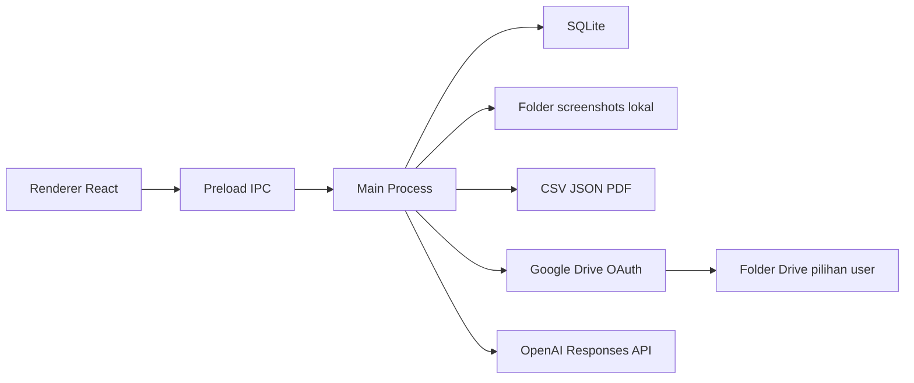

# Rencana Implementasi Enam Fitur Trading Journal

## Status Saat Ini

Proyek sudah berada pada versi 1.0.3 dengan arsitektur Electron, React, TypeScript, SQLite, dan IPC terpusat. Beberapa kebutuhan sudah memiliki fondasi, tetapi belum membentuk fitur yang diminta:

- [`TradeJournal.screenshotPath`](../shared/domain.ts:71) dan kolom `screenshot_path` sudah ada, tetapi UI belum menyediakan unggah/pratinjau.
- [`setupTag`](../shared/domain.ts:73) dan `emotionTag` masih berupa satu nilai tunggal; belum ada banyak tag kustom per transaksi.
- [`planned_risk`](../shared/domain.ts:94) sudah menyimpan `plannedStop`, `plannedTarget`, `riskAmount`, dan `plannedRr`, tetapi `plannedRr` belum dihitung otomatis dari entry, SL, dan TP.
- [`computeRMultiple()`](../shared/domain.ts:159) menghitung R realisasi dari P&L dan nominal risiko, bukan reward-to-risk rencana.
- Sinkronisasi exchange sengaja tidak menulis tabel jurnal; batas ini harus dipertahankan.

## Asumsi yang Disetujui

1. Screenshot disimpan lokal di folder data aplikasi dan satu screenshot aktif per trade.
2. Ekspor tersedia dalam CSV, JSON, dan PDF.
3. Google Drive memakai OAuth desktop dengan PKCE, folder dipilih pengguna, dan backup bersifat satu arah dari aplikasi ke Drive.
4. AI memakai OpenAI; API key disimpan di `safeStorage`, sedangkan nama model dapat diatur pengguna.
5. Semua operasi file, OAuth, Drive, dan OpenAI berjalan di main process. Renderer hanya menerima hasil yang sudah divalidasi.

## Arsitektur Alur Data

## Fitur 1 — Screenshot Journal

### Perubahan data dan keamanan

- Gunakan kolom `trade_journal.screenshot_path` yang sudah ada.
- Buat folder terkelola di `userData/data/screenshots`; jangan menyimpan path arbitrer dari renderer.
- Tambahkan channel IPC untuk menerima nama file dan bytes screenshot dari renderer, memvalidasi ekstensi serta magic bytes, membatasi ukuran, lalu menulis file dengan nama generik.
- Kembalikan path relatif terkelola, bukan path absolut.
- Saat screenshot diganti, hapus file lama setelah penyimpanan baru berhasil.
- Saat trade dihapus, hapus screenshot yang terkait.
- Tambahkan channel baca screenshot sebagai data URL tervalidasi agar renderer tidak memerlukan akses filesystem.

### UI

- Tambahkan input file/drop zone pada [`TradeEditor`](../src/routes/TradeEditor.tsx:1).
- Tampilkan pratinjau, nama file, tombol hapus, dan status unggah.
- Tampilkan indikator lampiran pada [`JournalEntry`](../src/routes/JournalEntry.tsx:1) dan detail trade.
- Untuk trade baru, simpan bytes sementara di state renderer lalu kirim bersamaan dengan payload trade; untuk trade lama, kirim saat tombol simpan ditekan.

### Verifikasi

- File bukan gambar ditolak.
- File melebihi batas ukuran ditolak.
- Mengganti gambar tidak meninggalkan file yatim.
- Menghapus trade menghapus lampiran lokal.
- Screenshot tetap tampil setelah aplikasi ditutup dan dibuka kembali.

## Fitur 2 — RR Rencana Otomatis

### Aturan hitung

- Risiko per unit: `abs(entryPrice - plannedStop)`.
- Reward per unit:
  - Long: `abs(plannedTarget - entryPrice)`.
  - Short: `abs(entryPrice - plannedTarget)`.
- `plannedRr = rewardPerUnit / riskPerUnit` jika risiko lebih besar dari nol.
- Jika SL kosong atau sama dengan entry, `plannedRr` tetap `null`, bukan nol.
- `riskAmount` tetap dihitung dari `riskPerUnit * size` dan dapat diubah manual.

### Perubahan kode

- Tambahkan `computePlannedRR()` ke [`shared/domain.ts`](../shared/domain.ts:152).
- Hitung ulang `plannedRr` di renderer setiap kali direction, entry, SL, atau TP berubah.
- Simpan nilai tersebut melalui [`writePlannedRisk()`](../electron/db/repositories/trades.ts:379).
- Pisahkan tampilan `RR Rencana` dari `R-Multiple Realisasi`; keduanya tidak boleh dianggap sama.
- Tambahkan validasi bahwa SL dan TP adalah angka valid bila diisi.

### Verifikasi

- Long dan short menghasilkan RR yang benar.
- SL sama dengan entry menghasilkan nilai kosong.
- Mengubah TP memperbarui RR tanpa menyimpan trade.
- Nilai RR tidak overwritten oleh sinkronisasi exchange.

## Fitur 3 — Tag Kustom Banyak Nilai

### Skema

- Buat tabel `journal_tags` dengan `id`, `name UNIQUE`, dan `created_at`.
- Buat tabel many-to-many `trade_journal_tags` dengan `trade_id`, `tag_id`, dan primary key gabungan.
- Pertahankan `setup_tag` dan `emotion_tag` lama untuk kompatibilitas data lama.
- Tambahkan indeks pada nama tag dan relasi trade.
- Tambahkan migrasi baru; jangan mengedit migrasi 001 atau 002.

### Perilaku

- Normalisasi input dengan menghapus spasi luar dan tanda `#` yang berulang.
- Izinkan tag bebas seperti `BTC_Scalp`, `ETH_Swing`, dan `SalahEksekusi`.
- Sediakan autocomplete dari tag yang pernah dipakai.
- Simpan relasi tag dalam transaksi bersama jurnal.
- Tambahkan filter tag pada Trade Log dan Journal Entry; filter banyak tag memakai语义 `SEMUA tag harus ada` agar hasil evaluasi lebih presisi.
- Tampilkan tag sebagai chip pada daftar trade, detail jurnal, dan hasil ekspor.
- Hapus relasi tag saat trade dihapus; tag katalog tetap dipertahankan agar riwayat ekspor tetap stabil.

### UI

- Ganti field `Setup / Strategi` tunggal dengan input multi-tag yang tetap mempertahankan nilai lama sebagai tag saat pertama kali dimigrasikan.
- Pertahankan `Tag Emosi` sebagai field terpisah karena maknanya berbeda dari tag evaluasi.
- Tambahkan filter chip/dropdown pada [`TradeLog`](../src/routes/TradeLog.tsx:1) dan [`JournalEntry`](../src/routes/JournalEntry.tsx:1).

### Verifikasi

- Satu trade dapat memiliki banyak tag.
- Tag yang sama tidak terduplikasi.
- Filter tag mengembalikan trade yang memenuhi semua tag terpilih.
- Sinkronisasi exchange tidak mengubah tag.
- Data lama tetap dapat dibaca setelah migrasi.

## Fitur 4 — Ekspor Journal

### Scope

- Ekspor semua trade atau trade yang sedang difilter.
- Format CSV, JSON, dan PDF.
- CSV dan JSON memuat data trade, jurnal, tag, checklist, planned risk, R realisasi, dan RR rencana.
- PDF dibuat dari HTML ringkas di main process melalui `BrowserWindow.webContents.printToPDF()`, lalu disimpan lewat dialog sistem.
- CSV menggunakan UTF-8 BOM agar dapat dibuka di Excel tanpa merusak karakter Indonesia.
- JSON menggunakan UTF-8 dan pretty-print.
- Screenshot tidak ditanam ke CSV/JSON; PDF dapat menampilkan path/nama lampiran dan thumbnail jika tersedia.

### API

- Tambahkan service ekspor di main process, bukan di renderer.
- Tambahkan channel IPC untuk memilih format, menerapkan filter, dan menyimpan file.
- Renderer hanya memilih format dan menerima status hasil.
- Tambahkan tombol Ekspor pada Trade Log dan Journal Entry.

### Verifikasi

- Ekspor kosong tetap menghasilkan file valid atau pesan yang jelas.
- CSV dapat dibuka dan kolom tag tidak merusak delimiter.
- JSON dapat diparse ulang.
- PDF dapat dibuka dan tidak kosong.
- Filter aktif diterapkan ke hasil ekspor.

## Fitur 5 — Backup Google Drive

### OAuth dan kredensial

- Gunakan alur OAuth installed-app dengan PKCE dan loopback redirect di main process.
- Minta scope Drive yang sesuai dan tampilkan penjelasan akses sebelum user menyetujui.
- Simpan refresh token dan access token lewat `safeStorage`, bukan SQLite atau log.
- Tambahkan status terhubung, akun yang digunakan, folder terpilih, dan waktu backup terakhir di Settings.
- Sediakan tombol putuskan koneksi yang menghapus token lokal.

### Folder dan backup

- Tampilkan daftar folder Drive yang dapat ditulis dan izinkan pengguna memilih folder target.
- Jika belum ada folder, izinkan pembuatan folder khusus aplikasi.
- Backup satu arah berisi:
  - snapshot JSON seluruh trade dan jurnal;
  - file screenshot terkait;
  - manifest berisi waktu backup, jumlah trade, dan checksum file.
- Gunakan nama file deterministik per trade atau manifest tetap yang diperbarui secara atomik, sehingga backup berikutnya tidak menumpuk salinan tak terkendali.
- Tambahkan tombol Backup Sekarang dan opsi backup otomatis setelah perubahan trade jika diaktifkan.
- Jangan menghapus data lokal dari Drive dan jangan mengklaim sinkronisasi dua arah pada implementasi awal.

### Verifikasi

- OAuth selesai tanpa mengekspos token ke renderer.
- Token dapat di-refresh tanpa login ulang.
- Backup berhasil ke folder yang dipilih.
- Backup berulang tidak membuat duplikat yang tidak terkendali.
- Token dicabut dan koneksi dapat diputus.
- Kegagalan jaringan ditampilkan tanpa menjatuhkan aplikasi.

## Fitur 6 — Wawasan AI OpenAI

### Konfigurasi

- Tambahkan Settings untuk API key OpenAI dan nama model.
- Simpan API key dengan `safeStorage`; nama model dan preferensi analisis disimpan di settings.
- Jangan pernah menulis key, prompt lengkap berisi data sensitif, atau response mentah ke log.
- Tampilkan pernyataan privasi bahwa data jurnal dikirim ke provider yang dipilih.

### Analisis

- Gunakan OpenAI Responses API dari main process dengan timeout dan batas ukuran payload.
- Buat prompt terstruktur dalam bahasa Indonesia untuk:
  - ringkasan performa;
  - kelemahan berulang berdasarkan tag, grade, waktu, dan review;
  - pola yang perlu diuji ulang;
  - saran proses trading yang dapat ditindaklanjuti;
  - batasan data dan larangan menganggap hasil sebagai jaminan profit.
- Analisis dapat menargetkan semua trade atau trade hasil filter aktif.
- Minta response JSON dengan schema yang stabil agar UI dapat merender bagian yang terpisah.
- Simpan hasil analisis lokal berdasarkan hash snapshot dan model agar tidak memanggil API berulang untuk data yang sama.
- Tambahkan tombol Analisa AI pada Analytics dan tampilkan status loading, error, serta hasil terstruktur.

### Verifikasi

- Key kosong menghasilkan pesan konfigurasi, bukan request.
- Model dapat diganti dan digunakan pada request berikutnya.
- Response invalid ditangani tanpa crash.
- Data yang sama menggunakan cache.
- Tidak ada kredensial atau data trade yang tercatat di log.
- UI menampilkan batasan analisis dengan jelas.

## Urutan Implementasi

1. Tambahkan migrasi dan kontrak domain/IPC untuk tag banyak nilai serta RR rencana.
2. Implementasikan screenshot lokal dan preview.
3. Perbaiki kalkulasi RR dan pisahkan RR rencana dari R realisasi.
4. Tambahkan tag kustom, autocomplete, dan filter.
5. Tambahkan ekspor CSV, JSON, dan PDF.
6. Tambahkan OAuth Google Drive, pemilihan folder, dan backup satu arah.
7. Tambahkan konfigurasi OpenAI, analisis AI, cache, dan UI hasil.
8. Tambahkan verifikasi otomatis serta dokumentasi pengguna.

## Rencana Verifikasi

- Jalankan `npm run typecheck`.
- Jalankan build Electron.
- Tambahkan skrip verifikasi khusus untuk migrasi, screenshot, tag, RR, ekspor, dan kontrak IPC.
- Uji OAuth dan Drive dengan akun Google sandbox atau akun pengguna yang menyetujui.
- Uji OpenAI dengan model yang dikonfigurasi pengguna; jangan hardcode key contoh.
- Uji installer Windows setelah semua fitur selesai.

## Batas Implementasi Awal

- Satu screenshot aktif per trade.
- Backup Drive satu arah, bukan restore atau sinkronisasi dua arah.
- AI menganalisis data terstruktur dan teks jurnal; screenshot tidak dikirim sebagai input vision pada implementasi awal.
- Tidak ada saran order, sinyal entry, atau klaim profit dari AI.

## File yang Diprediksi Terlibat

- [`shared/domain.ts`](../shared/domain.ts:1)
- [`shared/ipc-contract.ts`](../shared/ipc-contract.ts:1)
- [`electron/db/migrate.ts`](../electron/db/migrate.ts:1)
- [`electron/db/repositories/trades.ts`](../electron/db/repositories/trades.ts:1)
- [`electron/ipc/handlers.ts`](../electron/ipc/handlers.ts:1)
- [`electron/preload.ts`](../electron/preload.ts:1)
- [`src/routes/TradeEditor.tsx`](../src/routes/TradeEditor.tsx:1)
- [`src/routes/TradeLog.tsx`](../src/routes/TradeLog.tsx:1)
- [`src/routes/JournalEntry.tsx`](../src/routes/JournalEntry.tsx:1)
- [`src/routes/Analytics.tsx`](../src/routes/Analytics.tsx:1)
- [`src/routes/Settings.tsx`](../src/routes/Settings.tsx:1)

## Kriteria Selesai

Semua enam fitur dapat digunakan dari UI, data tetap aman saat sinkronisasi exchange, migrasi berhasil pada database lama, tidak ada kredensial yang bocor ke renderer/log, dan seluruh verifikasi otomatis serta pengujian installer lulus.